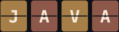

# Alberto Claros López

<!-- ASCII_PORTRAIT:START -->
<pre>
Retrato en generacion automatica: el workflow de GitHub Actions
".github/workflows/generate-ascii-portrait.yml" sustituye este bloque
por el arte ASCII real en cuanto se ejecuta tras el primer push.
</pre>
<!-- ASCII_PORTRAIT:END -->

---

Sevilla. DAM recién terminado. Busco mi primer puesto como backend junior, en Sevilla o en remoto, y hasta que lo consiga sigo programando como si ya lo tuviera: con disciplina y sin entregar nada a medias.

## Lo que he construido

**[Vitalmas](https://github.com/albertocll/Vitalmas)**: Gestión médica full-stack. Spring Boot 3.5 + PostgreSQL por detrás, React + Vite por delante, todo en Docker. 97 commits, release v2.0.0, desplegado en Railway, con otro desarrollador metiendo pull requests de verdad.

**[NeonStrike2D](https://github.com/albertocll/NeonStrike2D)**: Shooter cooperativo 2D en Unity 6 + C#, con backend propio en ASP.NET Core y multijugador en tiempo real por WebSocket. Mi Trabajo de Fin de Grado, defensa el 2 de junio. 295 commits y subiendo, 27 issues abiertos porque lo sigo ampliando, no porque esté parado.

## Fuera del código

Entreno fuerza cinco días a la semana, sin excusas ni días a medias. La misma disciplina la aplico al código. El resto del tiempo: deportes de riesgo, videojuegos de aventura y lucha, anime, pelis de terror y algo de manualidades.

---

📫 albertoclaroslaboral@gmail.com · [LinkedIn](https://linkedin.com/in/albertocll/)
